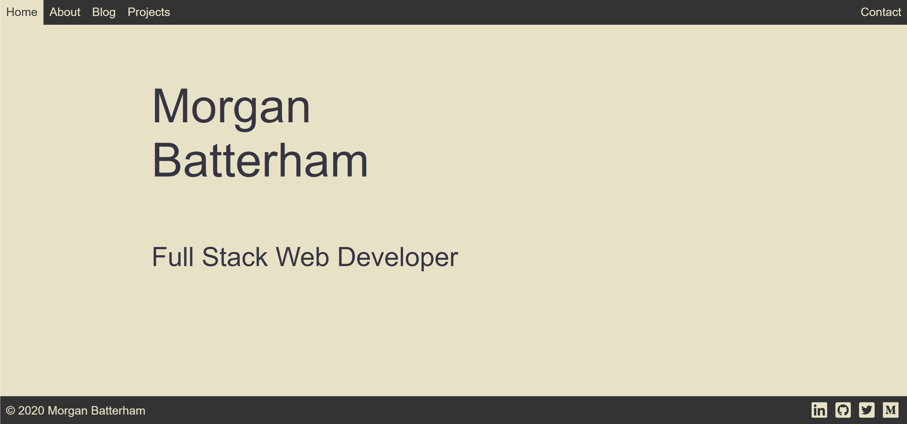
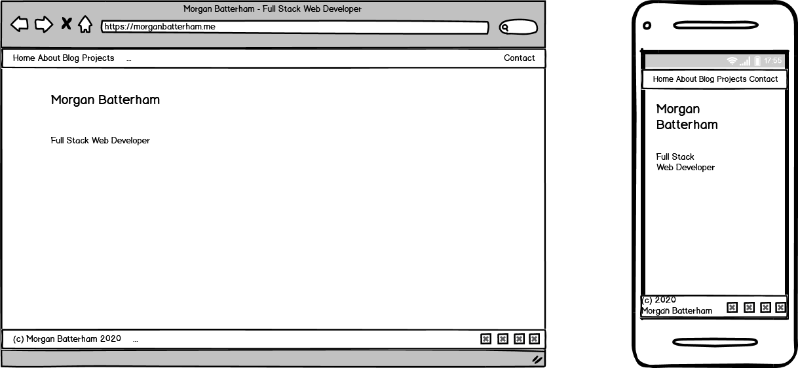

## Morgan Batterham

## Portfolio Website for assessment T1A3

repo hosted at https://github.com/MorganBat/morganbat.github.io

website available at https://morganbatterham.me

#### Purpose
The purpose of this website is to create a mobile responsive website to showcase my abilities in various web development technologies such as HTML, CSS etc.

The website will contain data such as my Name, email address, and links to various Social Media profiles including my GitHub, LinkedIn, Twitter and Medium profiles.

#### Functionality/Features

#### Sitemap

#### Screenshots

Index Page

About Page

Blog Page

Projects Page

Contact Page

#### Wire Frames

Index Page

About Page

Blog Page

Projects Page

Contact Page

#### Target audience

This website is primarily designed for the staff at Coder Academy!

Future versions will be designed to showcase my abilities as a developer to potential employers or collaborators.

#### Technology Stack

-HTML5

-CSS

-GitHub Pages for hosting

-PorkBun for domain registration

-draw.io for Sitemap production

-Balsamiq Wireless for Wireframe production